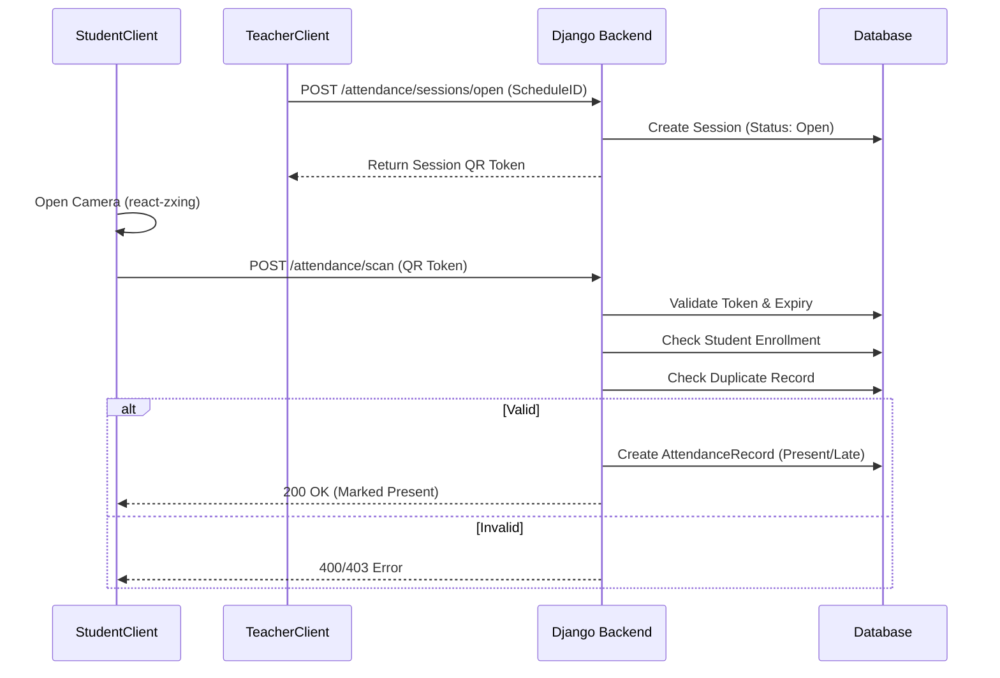

# Student Attendance Management Information System (MIS) - Technical Documentation

**Version:** 1.0.0  
**Status:** Production Ready  

---

## 📖 Table of Contents

1. [System Overview](#1-system-overview)
2. [Core Features](#2-core-features)
3. [Technology Stack](#3-technology-stack)
4. [Full System Architecture](#4-full-system-architecture)
5. [Backend Overview](#5-backend-overview)
6. [Authentication & Authorization](#6-authentication--authorization)
7. [Data Models & ERD](#7-data-models--erd)
8. [API Documentation](#8-api-documentation)
9. [Frontend Structure](#9-frontend-structure)
10. [QR Scanning System](#10-qr-scanning-system)
11. [Axios & API Integration](#11-axios--api-integration)
12. [Protected Routes & Security](#12-protected-routes--security)
13. [Deployment Guide](#13-deployment-guide)
14. [Testing & Quality Assurance](#14-testing--quality-assurance)
15. [Future Enhancements](#15-future-enhancements)

---

## 🏛️ 1. System Overview

The **Student Attendance MIS** is a full-stack web application designed to modernize and streamline the attendance tracking process in educational institutions. It replaces manual paper-based attendance with a secure, digital QR-code-based system.

### Purpose
To provide a reliable, cheat-proof, and efficient method for teachers to record class attendance and for administrators to monitor student engagement.

### Daily Workflow
1.  **Teacher** logs in and opens a "Class Session" for a specific schedule.
2.  **System** generates a unique, time-sensitive QR code for that session (or simply verifies valid students). *Note: In this implementation, the backend validates scanned QR codes from student IDs, or generates session tokens for students to scan. (Based on code: Teachers open sessions which have QR tokens, students scan them OR device scans student QRs. The implemented `ScanViewSet` validates a `qr_token` from a session against a `student_id` context, or processes a student scanning a session QR. The currently active code suggests students scan a Session QR code to mark themselves present).*
3.  **Student** uses the web app (or physical ID) to scan the Session QR code or has their ID scanned by the teacher's device.
4.  **Device** sends the encrypted token to the backend.
5.  **Backend** validates the session status, enrollment, and time (marking "Late" if applicable).
6.  **Database** records the timestamp and status.

### Problems Solved
*   Eliminates "proxy" attendance (buddy punching) via device/session validation.
*   Reduces class time wasted on roll calls.
*   Provides real-time analytics on student attendance.

---

## 🧩 2. Core Features

*   **JWT Authentication:** Secure, stateless authentication with access and refresh tokens.
*   **Role-Based Access Control (RBAC):** Distinct portals for Admins, Teachers, and Students.
*   **Dynamic QR Attendance:**
    *   Teachers can "Open" and "Close" attendance sessions.
    *   Real-time duplicate scan prevention.
    *   Automatic "Late" marking after 15 minutes.
*   **Section Management:** Teachers only see sections assigned to them.
*   **Student Profiling:** Full profiles linked to system users and enrollment sections.
*   **Audit Logging:** Tracks scan actions and system modifications.
*   **Analytics Dashboard:** Summary views of total students, teachers, and active sessions.

---

## 🔧 3. Technology Stack

### Backend
*   **Framework:** Django 5.2.8 + Django REST Framework (DRF)
*   **Authentication:** `rest_framework_simplejwt`
*   **Database:** SQLite (Dev) / PostgreSQL (Prod ready)
*   **CORS:** `django-cors-headers`

### Frontend
*   **Library:** React.js (Vite)
*   **Scanning:** `react-zxing` (BarcodeDetector API wrapper)
*   **HTTP Client:** Axios with Interceptors
*   **Styling:** CSS Modules / Vanilla CSS (Tailwind ready)
*   **Routing:** `react-router-dom` v6

---

## 🖧 4. Full System Architecture

### Request/Response Flow


### Microservice Boundaries
Currently a **Monolithic** architecture. The `api`, `users`, `attendance`, and `qr` modules run within the same Django process but are decoupled logic-wise for future splitting.

---

## 🗃️ 6. Backend Overview

### App Structure
*   `backend/`: Project settings, URL routing, WSGI/ASGI apps.
*   `api/`: Centralized `urls.py` and potentially common serializers.
*   `users/`: Handles `CustomUser`, `StudentProfile`, and auth Logic.
*   `attendance/`: Core business logic (Sections, Schedules, Sessions, Records).
*   `qr/`: Device management and system logs.

### Key Components
*   **Settings (`settings.py`):**
    *   `AUTH_USER_MODEL = 'users.CustomUser'`
    *   `SIMPLE_JWT`: configured for 60min access, 1 day refresh.
    *   `CORS_ALLOWED_ORIGINS`: Includes localhost for dev.
*   **Permissions (`users/permissions.py`):**
    *   Custom classes: `IsTeacher`, `IsStudent`, `IsTeacherOrAdmin`.
*   **ViewSets:** Application uses standard `ModelViewSet` for CRUD and `ViewSet` for logic endpoints (e.g., `ScanViewSet`).

---

## 🔐 7. Authentication & Authorization

### JWT Flow
1.  **Login:** `POST /api/auth/login/` with email/password.
2.  **Response:** Returns `access` (short-lived) and `refresh` (long-lived) tokens.
3.  **Storage:** Recommended in-memory or securely in HTTPOnly cookies (currently localStorage implementation in frontend).
4.  **Refresh:** Frontend interceptor catches 401 errors -> calls `/api/auth/refresh/` -> retries original request transparently.

### Role Restrictions
*   **Admin:** Full access to all endpoints.
*   **Teacher:** Can only modify their own Sections, Schedules, and Sessions. Read-only on Global settings.
*   **Student:** Read-only on own Profile and Attendance Records. Write access only to `scan` endpoint.

---

## 🧬 8. Data Models & ERD

### Users App
*   **CustomUser:** Extends `AbstractUser`. Fields: `role` (admin/teacher/student), `firstname`, `lastname`.
*   **StudentProfile:** 1:1 with CustomUser. Fields: `student_number`, `sections` (M2M).

### Attendance App
*   **Department/Program/Course:** Academic hierarchy.
*   **Section:** Linked to `Program` and `Instructor` (User).
*   **ClassSchedule:** Links `Course` + `Section` + `Day` + Time.
*   **AttendanceSession:** Represents a single class meeting.
    *   `qr_token`: UUID for the session scanning.
    *   `closed_at`: Timestamp when attendance ended.
*   **AttendanceRecord:** The actual log.
    *   `student`: FK to StudentProfile.
    *   `session`: FK to AttendanceSession.
    *   `status`: Present, Late, Absent.

### Relationships
*   `Section` -> has many -> `ClassSchedule` -> has many -> `AttendanceSession` -> has many -> `AttendanceRecord`.
*   `StudentProfile` <-> has many <-> `Section`.

---

## 🌐 9. API Documentation

### Auth
| Method | Endpoint | Description |
| :--- | :--- | :--- |
| POST | `/api/auth/login/` | Get access/refresh tokens |
| POST | `/api/auth/refresh/` | Get new access token |
| POST | `/api/auth/logout/` | Blacklist refresh token |

### Attendance
| Method | Endpoint | Description |
| :--- | :--- | :--- |
| GET | `/api/attendance/sessions/` | List sessions (Teacher filtered) |
| POST | `/api/attendance/sessions/{id}/open/` | Start a class session (generates QR) |
| POST | `/api/attendance/sessions/{id}/close/` | End session |
| GET | `/api/attendance/sessions/{id}/monitoring/` | Live view of scanned students |
| POST | `/api/attendance/scan/` | Submit QR token. Body: `{qr_token, student_id}` |

### Users & Profiles
| Method | Endpoint | Description |
| :--- | :--- | :--- |
| GET | `/api/users/` | List users (Admin only) |
| GET | `/api/student-profiles/` | List profiles |

---

## 🎥 10. Frontend Structure

### React Architecture (`src/`)
*   **`api/`**: Axios instances (`axios.js`, `axiosInstance.js`) and endpoint definitions.
*   **`components/`**: Reusable UI (Header, Footer, Inputs).
    *   **`scanner/`**: Contains `QRScanner.jsx`.
*   **`pages/`**: View controllers.
    *   `admin/`, `teacher/`, `student/` subdirectories.
*   **`hooks/`**: Custom logic.
    *   `useAuth.js`: Global auth state.
    *   `useAxiosPrivate.js`: Interceptor logic.
*   **`context/`**: `AuthProvider`.

---

## 📷 11. QR Scanning Strategy

### Library: `react-zxing`
Utilizes the browser's native `BarcodeDetector` API where available, falling back to WASM generic implementations.

### Implementation (`QRScanner.jsx`)
1.  **Initialization:** Requests Camera permissions (`navigator.mediaDevices.getUserMedia`).
2.  **Detection:** Runs continuous stream analysis.
3.  **Cooldown:** Implements a 2000ms cooldown (`SCAN_COOLDOWN`) prevents accidental double HTTP requests for the same code.
4.  **Error Handling:** Silently catches frame errors, alerts user only on Permission/Device errors.

---

## 🔌 12. Axios Integration

### `useAxiosPrivate` Hook
Ensures seamless experience even when tokens expire.

1.  **Request Interceptor:** Automatically injects `Authorization: Bearer <token>` into every private request.
2.  **Response Interceptor:**
    *   Listens for `401 Unauthorized`.
    *   **If 401:** Pauses original request.
    *   Sends request to `/auth/refresh/` with refresh token.
    *   **Success:** Updates `auth` state with new token, updates original request header, and retries.
    *   **Failure:** Logs user out (redirects to login).

---

## 🛡️ 13. Protected Routes

**`ProtectedRoute.jsx` component:**
*   Wraps all private routes in `App.jsx`.
*   **Checks:**
    1.  Is user logged in? (Token exists).
    2.  Does user have correct role? (e.g., trying to access `/teacher` while role is `student`).
*   **Action:** Redirects to `/login` or `/unauthorized` accordingly.

---

## ⚠️ 14. Error Handling

### Backend
*   **Validation Errors (400):** Returned when forms/serializers fail.
*   **Permission Errors (403):** Returned if a student tries to mark attendance for a class they aren't enrolled in.
*   **Not Found (404):** Invalid IDs.

### Frontend
*   **Scanner:** Displays "Camera access denied" if permission fails.
*   **Forms:** Displays server error messages (e.g., "Wrong Password") in UI alerts.
*   **Silent Failures:** Duplicate scans often return 200 OK with "Already recorded" message to prevent disrupting the line.

---

## 🚀 15. Deployment Guide

### Prerequisites
*   Python 3.10+
*   Node.js 18+

### Steps
1.  **Backend:**
    ```bash
    cd backend
    pip install -r requirements.txt
    python manage.py migrate
    python manage.py collectstatic
    gunicorn backend.wsgi:application
    ```
2.  **Frontend:**
    ```bash
    cd frontend
    npm install
    npm run build
    # Serve 'dist' folder via Nginx/Apache
    ```
3.  **Environment Variables (`.env`):**
    ```
    DEBUG=False
    SECRET_KEY=prod_key
    ALLOWED_HOSTS=yourdomain.com
    DATABASE_URL=postgres://...
    ```

### HTTPS Requirement
**Crucial:** Browser Camera API (`getUserMedia`) **requires HTTPS** in non-localhost environments. Deployment must use SSL (Cloudflare/Certbot).

---

## 📈 17. Future Enhancements

1.  **Offline Support:** Use Service Workers to cache attendance scans if internet drops, then sync when online.
2.  **Geofencing:** Validate GPS coordinates along with QR scan.
3.  **Push Notifs:** Alert students 10mins before class starts.
4.  **Parental Portal:** Allowing parents to view attendance logs.
